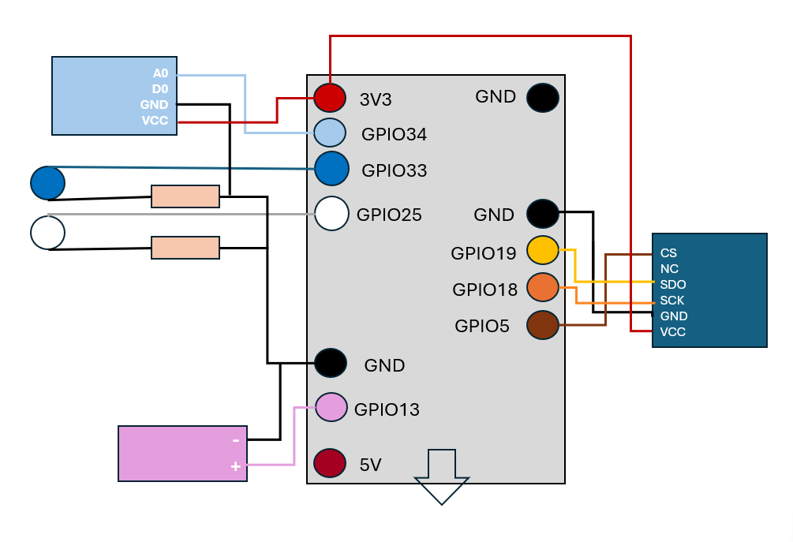

<p align="center">
  
</p>
<h1 align="center"> 🌱 POCO - Le pot connecté </h2>


**Ce dépôt contient uniquement la partie <strong>IoT</strong> du projet POCO.**  
Il s'agit d'un système embarqué sur ESP32 permettant de surveiller l'état d'un pot de plante en temps réel.


---

### 🚀 Objectifs

- Connexion Wifi
- Lire les données des capteurs de lumière et d’humidité  
- Détecter les besoins de la plante (lumière/eau)  
- Activer des LEDs en réponse  
- Transmettre les données via MQTT  

---

### 🧠 Fonctionnement

Le microcontrôleur ESP32 lit les capteurs connectés :

- 💧 **Capteur d'humidité du sol** (détecte si la plante a besoin d'eau)  
- ☀️ **Capteur de luminosité** (détecte si la plante reçoit assez de lumière)  

En fonction des seuils définis, il active :

- 💡🔵 **LED bleu** pour l'eau (pompe simulée)  
- 💡⚪ **LEDs blanche** pour simuler la lumière artificielle  

Les données sont également envoyées via ***<u>MQTT</u>*** pour affichage ou analyse.

---

### 🔧 Matériel utilisé

| Composant | Rôle |
|-----------|------|
| ESP32 | Microcontrôleur Wi-Fi |
| Capteur d'humidité du sol (GPIO34)| Mesure l’humidité 🌱 |
| Capteur de lumière PB200-286 (GPIO5/GPIO18/GPIO19) | Mesure la luminosité ☀️ |
| LED bleue (GPIO33) | Simule l'activation de la pompe 💧 |
| LEDs blanche (GPIO27) | Simulent la lumière artificielle 💡 |

### Schéma de câblage

<p align="center">
  
</p>

- Capteur de lumière en bleu foncé
- Capteur d'humidité en bleu clair
- Led bleue
- Led blanche
- Pompe en rose

---

### 📂 Les codes 
 - [`code-final.py`](./code-final.py)  
  ↪ Version principale du code embarqué. Il intègre la lecture des capteurs, la logique de contrôle des LEDs, la connexion Wifi et l'envoi MQTT.   
  *A compléter avec vos données de Wifi et du broker.*

- [`code-poco.py`](./code-poco.py)  
  ↪ Une version antérieure du code final. Pas de gestion des leds.   
    *A compléter avec vos données de Wifi et du broker.*

- [`adresse-mac.py`](./adresse-mac.py)  
  ↪ Script pour récupérer l’adresse MAC de l’ESP32.

- [`wifi.py`](./wifi.py)  
  ↪ Contient une fonction pour se connecter au wifi.   
  *A compléter avec vos identifiants personnels*

- [`mqtt.py`](./mqtt.py)  
  ↪ Gère la configuration et l’envoi des données vers un broker MQTT.   
  *A compléter avec les données de votre broker.*

- [`humidité.py`](./humidité.py)  
  ↪ Script dédié à la lecture du capteur d’humidité du sol.

- [`luminosité.py`](./luminosité.py)  
  ↪ Script dédié à la lecture du capteur de lumière (PB200-286).


### POUR EXECUTER :

**<u>Avec THONNY</u>**
- Ouvrir `Thonny` *(à télécharger [ici](https://thonny.org/))*
- Dans Thonny, configurer l'interpréteur selon le port sur lequel votre carte est branchée
- Ouvrir le fichier que vous souhaitez exécuter, puis appuyer sur la flèche verte `executer`
- Bien appuyer sur Stop (le bouton rouge) pour relancer le code proprement

**<u>AVEC AMPY</u>**
- Installer ampy
```
pip install adafruit-ampy
```
- Connaître le port série de ton ESP32
    - Windows : via le Gestionnaire de périphériques (Ports COM).
    - Linux/macOS : avec ls /dev/tty.* ou ls /dev/ttyUSB*.

***Pour POCO avec Windows***
```
ampy --port 'votre port' put adresse-mac.py
ampy --port 'votre port' put wifi.py
ampy --port 'votre port' put mqtt.py
ampy --port 'votre port' put humidité.py
ampy --port 'votre port' put luminosité.py
ampy --port 'votre port' put code-poco.py
ampy --port 'votre port' put code-final.py
```


---

### 🧩 C’est quoi MQTT ?
MQTT (Message Queuing Telemetry Transport) est un protocole de messagerie léger spécialement conçu pour les objets connectés. Il fonctionne avec un système de "publish/subscribe", ce qui signifie que :

Les objets publient des données (température, humidité, etc.) sur un topic.

D’autres appareils ou applications s’abonnent à ces topics pour recevoir les données en temps réel.

--- 

### 🔑 C’est quoi une adresse MAC ?
Une adresse MAC (Media Access Control) est un identifiant unique attribué à chaque appareil connecté à un réseau (Wi-Fi, Ethernet, etc.). Elle est généralement composée de 6 paires de caractères hexadécimaux, comme ceci : 3C:71:BF:09:4A:2E

Dans le cas de POCO :

Chaque pot de plante connecté (ESP32, ESP8266…) a sa propre adresse MAC.

Cela permet de différencier les différents pots dans le réseau, utile si tu en as plusieurs.